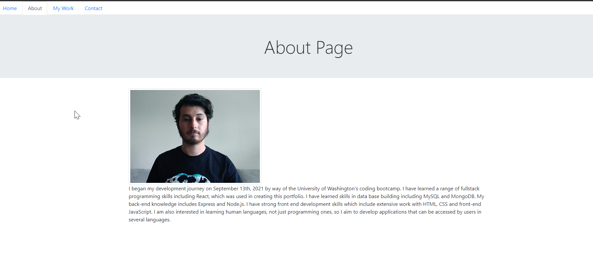

# <react-portfolio-v1>

## description
This application serves as a portfolio built using React. This one page application gives the illusion of having multiple pages which are rendered conditionally via the navbar. This project was built with the intention of practicing working with React. This application

## Credits
Credits to the UW coding bootcamp instructional staff and the activities that we reviewd for React which provided the know-how necessary to create this app.
[Github Logo Icon]("https://iconscout.com/icons/github") by [Alexis Doreau](https://iconscout.com/contributors/alexis-doreau)
[Heroku Logo Icon]("https://iconscout.com/icons/heroku") by [Jagathish Saravanan](https://iconscout.com/contributors/jagathish)

## Instalation
This page can be accessed from this [heroku page](https://jorge-react-portfolio.herokuapp.com/). The Github repository can be found by [clicking here]().

## Usage 
The user will use the tabs in the nav-bar to look through the different sections of my portfolio.

## Testing 
Testing was done through running the server and using the page
